<div align="center">

# BitQuiz

**Live quiz competitions that run in real time.** An organizer runs every question from one console, participants answer from their phones, and every screen updates at the same moment. Faster correct answers score more.

[](https://github.com/k-i-mahi/BitQuiz/actions/workflows/ci.yml)
[](LICENSE)
[](https://bitquiz.onrender.com)

[**Live site**](https://bitquiz.onrender.com) · [Deploy for free](docs/DEPLOY_RENDER.md) · [Changelog](CHANGELOG.md) · [Report a bug](https://github.com/k-i-mahi/BitQuiz/issues/new/choose)

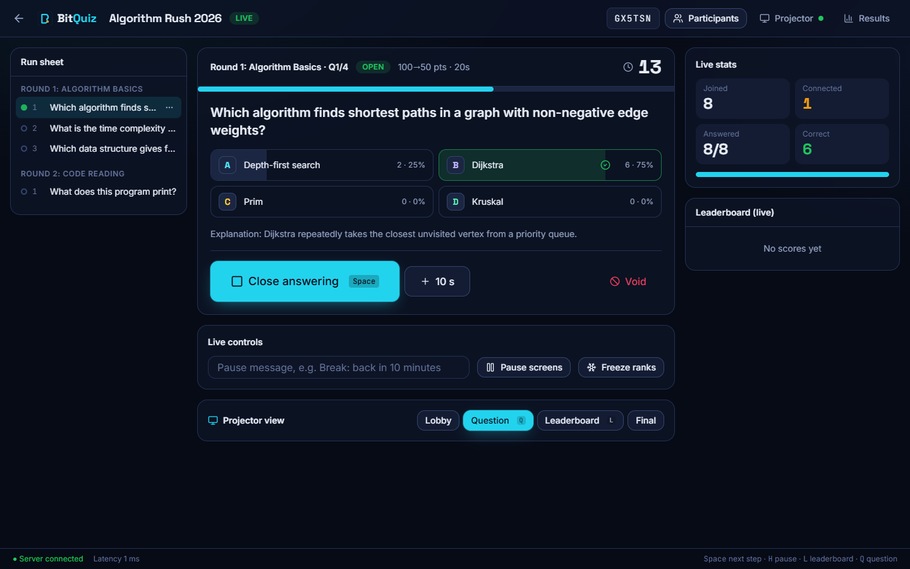

</div>

Built for IEEE CS KUET quiz events of 100–300 participants in one hall. Tested with 300 simulated players on a free 0.1-CPU server.

## Contents

- [Screenshots](#screenshots)
- [Features](#features)
- [How a quiz runs](#how-a-quiz-runs)
- [Architecture](#architecture)
- [Getting started](#getting-started)
- [Configuration](#configuration)
- [Deployment](#deployment)
- [Testing and performance](#testing-and-performance)
- [Security](#security)
- [Project structure](#project-structure)
- [Limitations](#limitations)
- [Contributing](#contributing)
- [License](#license)

## Screenshots

<table>
  <tr>
    <td width="33%">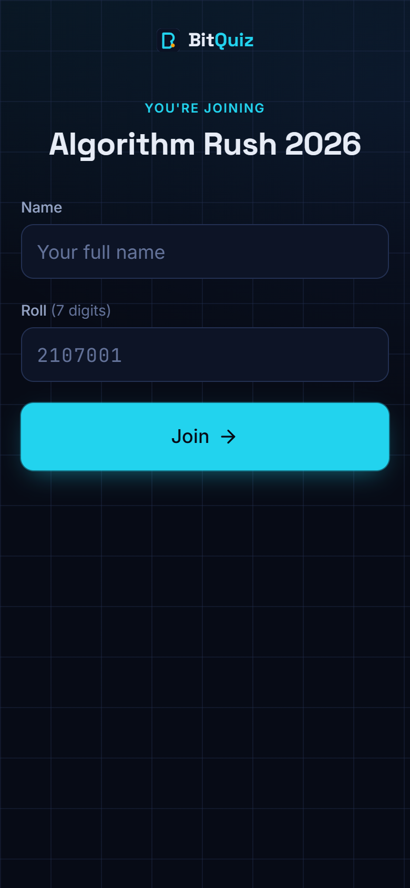<br><sub><b>Join:</b> name and roll, validated per competition</sub></td>
    <td width="33%">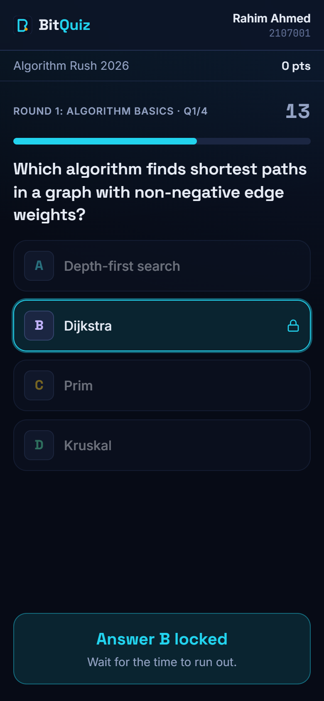<br><sub><b>Answer:</b> tap, lock, server-timed countdown</sub></td>
    <td width="33%">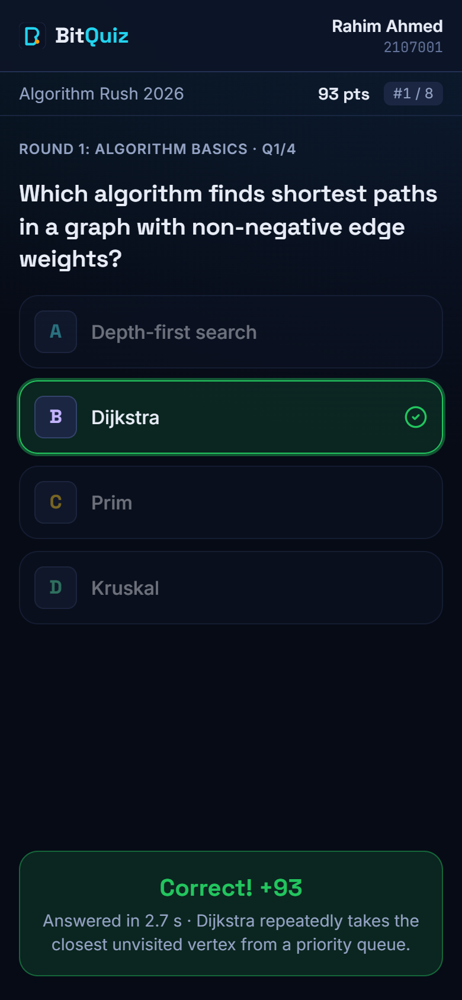<br><sub><b>Result:</b> points for speed, rank, explanation</sub></td>
  </tr>
</table>

| Projector: question                                             | Projector: reveal                                                    |
| --------------------------------------------------------------- | -------------------------------------------------------------------- |
| 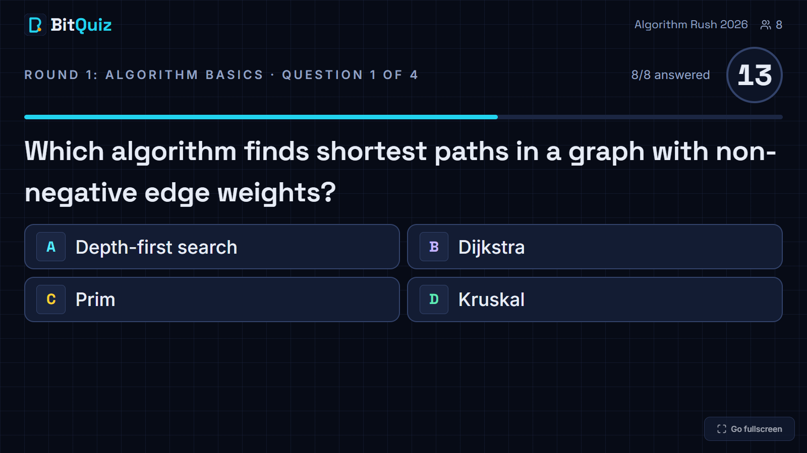  | 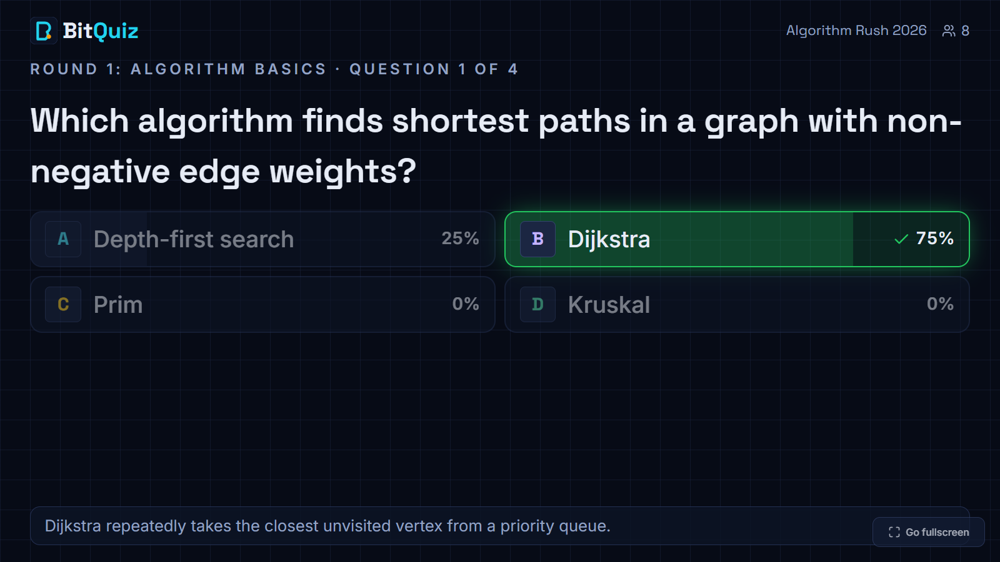           |
| **Projector: code question**                                    | **Projector: live leaderboard**                                      |
| 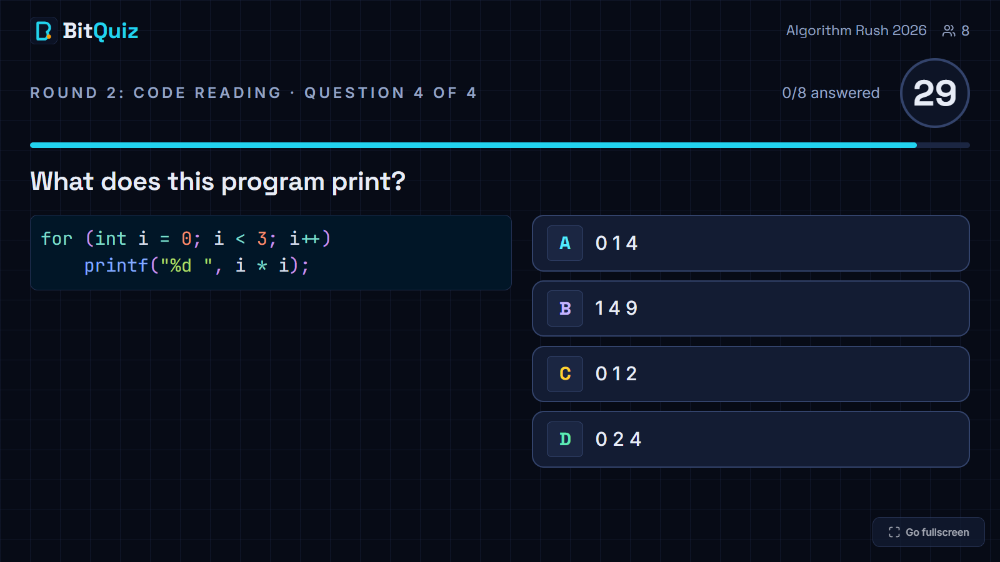 | 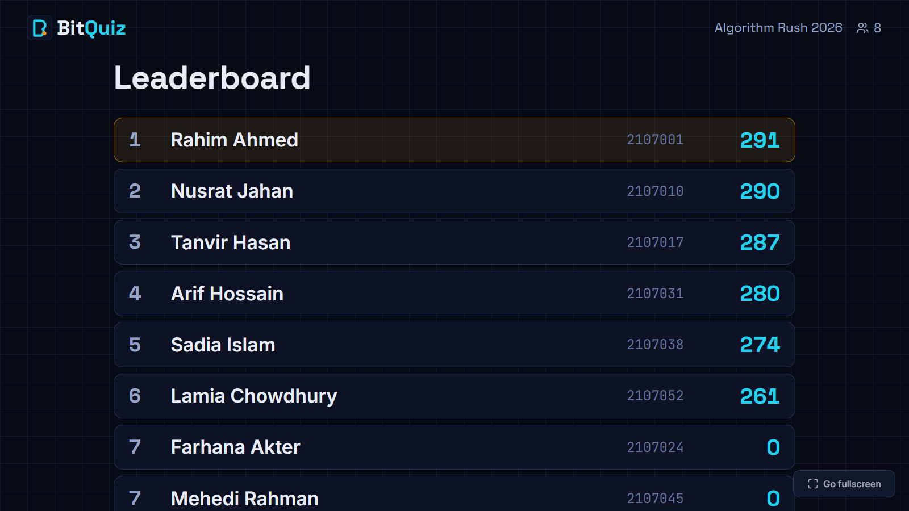 |

| Console lobby (join QR code)                         | Final podium                                          |
| ---------------------------------------------------- | ----------------------------------------------------- |
| 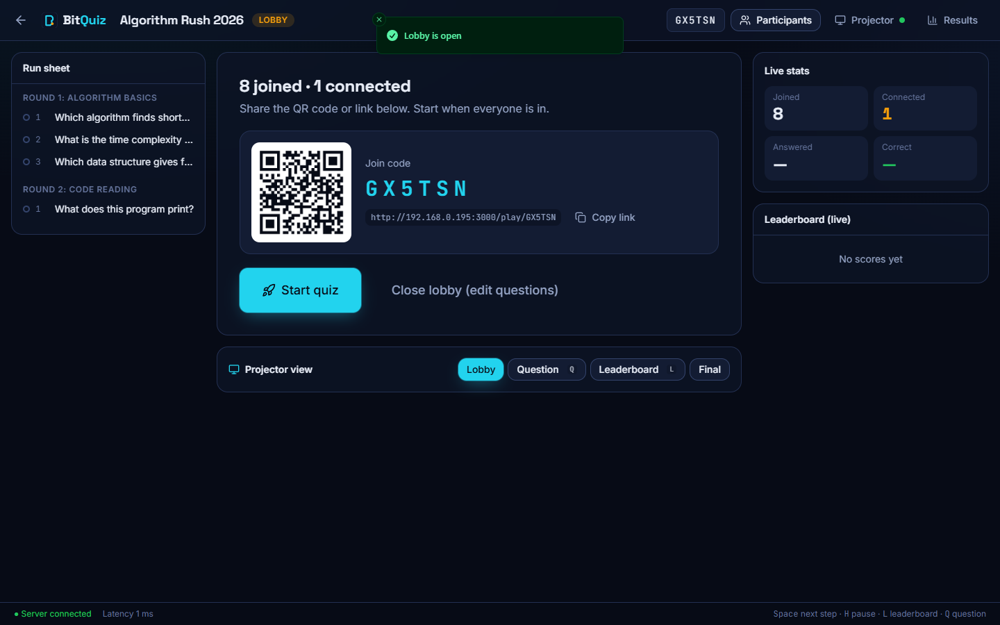 | 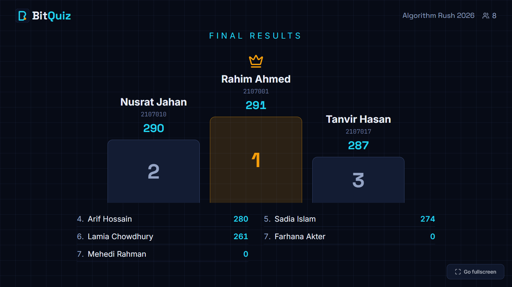 |
| **Competition editor**                               | **Results and exports**                               |
| 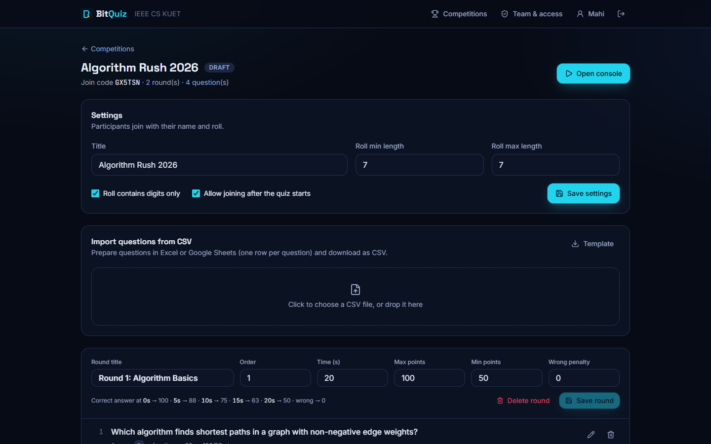               | 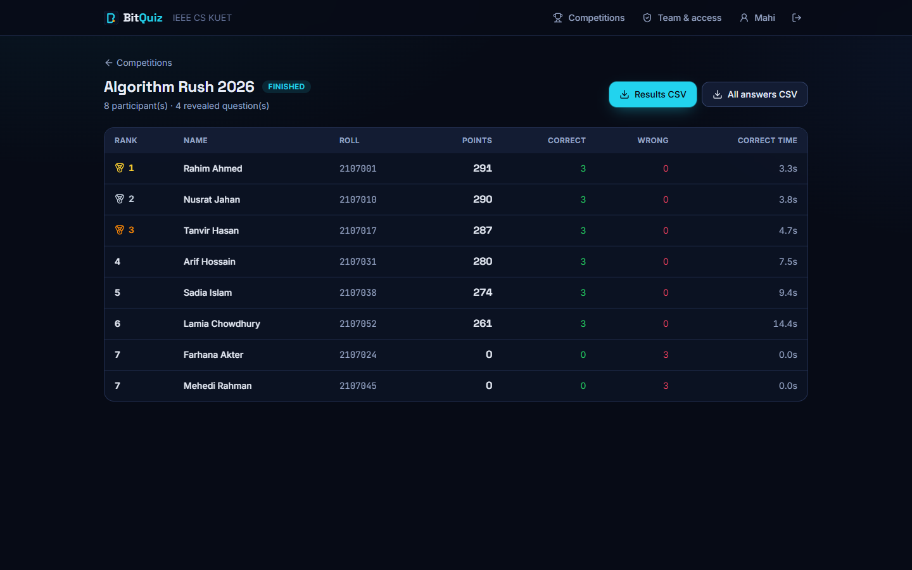              |
| **Team & access**                                    | **Invitation with shareable link**                    |
| 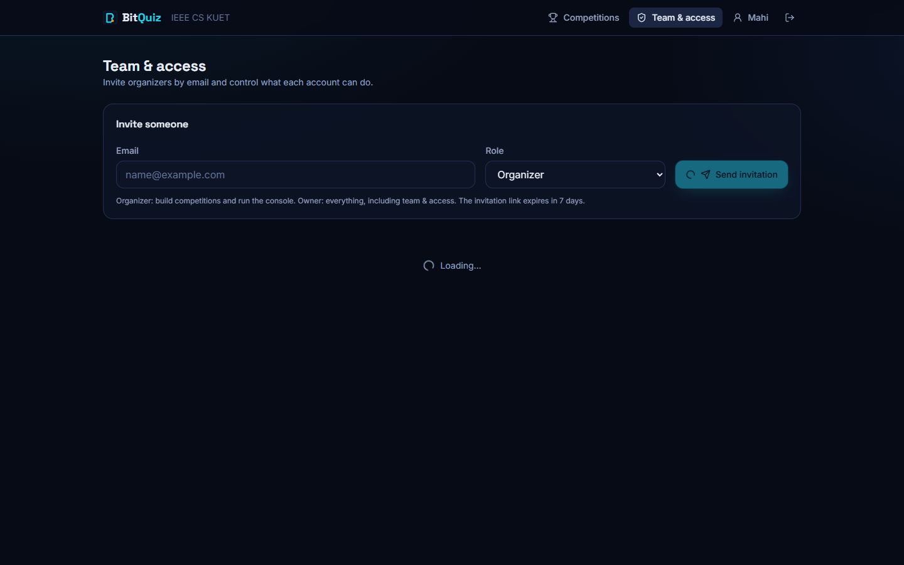          | 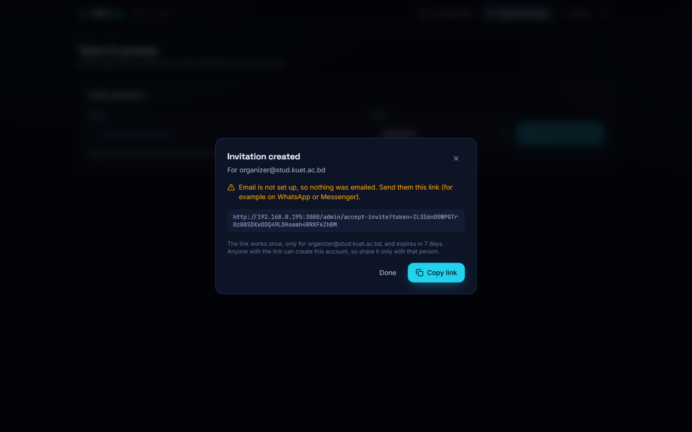       |

## Features

**Running a quiz**

- **One live console.** Show → open (timer starts) → close → reveal → next, all from the keyboard (`Space`). Extend by 10 s, void a question, fix a wrong answer key (regrade), or re-ask a question.
- **Server-authoritative timer.** Every phone counts down to the same server deadline, whatever its own clock says. A 1-second grace window absorbs network delay.
- **Speed scoring with a floor.** A correct answer earns between `minPoints` (at the deadline) and `maxPoints` (instant), so being right always matters more than being fast. Optional negative marking. Each phone's network delay is measured and subtracted, capped at 0.5 s.
- **Fair tie-breaks:** points, then number correct, then total answer time.
- **Live leaderboard**, with **freeze** for a suspenseful final round, and a final podium.
- **Pause screens** with a message, e.g. "Break: back in 10 minutes".

**Participants**

- **Join in seconds:** scan the QR code, enter name and roll. Roll format (length, digits only) is set per competition.
- **One device per roll.** Nobody can take over someone else's roll; the organizer can reset a device if a phone dies, and the participant keeps their points.
- **Refresh-proof.** Reloading or reconnecting restores the exact screen; answers are locked and safe on the server.

**Organizers**

- **Text and code questions** with 2–6 options (True/False included), syntax highlighting, explanations, and per-question time and points.
- **CSV import** with a row-by-row preview of problems (Excel/Google Sheets friendly), plus **results** and **all-answers** CSV exports.
- **Projector optional.** Projector controls appear only when a projector screen is connected. Without one, the console shows the join QR code and link.
- **Invite-only accounts with real email.** Owners invite organizers by email; invitees set their own password. Email verification and "forgot password" links. Invitations always come with a shareable link in case email is slow.
- **Team & access.** Owners change roles, suspend or reactivate accounts, sign people out everywhere, remove members, and resend or revoke invitations. There is always at least one active owner.

## How a quiz runs

1. An organizer creates a competition, adds questions (form or CSV) and opens the **lobby**.
2. Participants scan the QR code (console or projector) and join with name and roll.
3. The organizer starts the quiz and steps through questions. Phones, console and projector update together.
4. After each reveal, phones show the result and the leaderboard updates; at the end everyone sees the podium.
5. The organizer downloads the results.

## Architecture

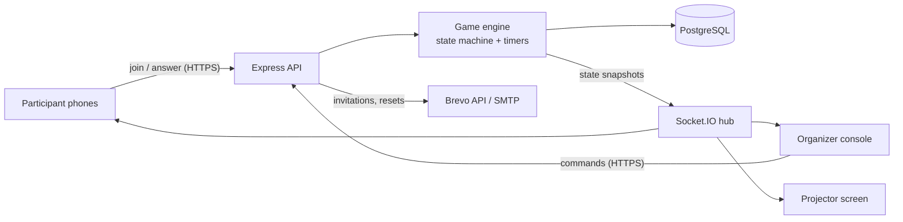

- **The server is the only source of truth.** Clients send actions over HTTPS; the server validates them, stores state in PostgreSQL and pushes a role-specific snapshot to every screen. Correct answers never leave the server before the reveal.
- **Safe live control.** Every command carries the state revision it was issued against and runs in one transaction, so a double click can't skip a question and a backup laptop can stay open.
- **Built for small servers.** A snapshot is built once per change and shared by every screen; answers only refresh the organizer's and projector's counters. Open question timers are restored after a restart.

## Getting started

Requirements: Node.js 22+ and Docker (for PostgreSQL).

```bash
git clone https://github.com/k-i-mahi/BitQuiz.git
cd BitQuiz
cp .env.example .env              # set SESSION_SECRET and the SEED_* values
docker compose up -d db           # PostgreSQL on 127.0.0.1:${DB_PORT:-5432}
npm install
npm run db:migrate                # create tables
npm run db:seed -w server         # organization + first owner account
npm run dev                       # API on :3000, website on http://localhost:5173
```

Add `npm run db:seed:demo -w server` for a three-question demo competition. Phones on the same Wi-Fi can join through `http://<your-computer-ip>:5173`.

Without email settings, invitation and password-reset emails are printed in the server log, so every flow works locally.

| Command                                                                            | What it does                                                  |
| ---------------------------------------------------------------------------------- | ------------------------------------------------------------- |
| `npm run dev`                                                                      | Server (watch mode) and Vite dev server                       |
| `npm run build` / `npm start`                                                      | Production build / run the server (serves the built website)  |
| `npm test`                                                                         | Unit tests, plus integration tests when `DATABASE_URL` is set |
| `npm run lint` / `npm run format` / `npm run typecheck`                            | Code quality                                                  |
| `npm run loadtest -- --url <server> --email <owner> --password <pw> --players 300` | Simulated competition (see below)                             |

## Configuration

| Variable                                                                      | Required    | Purpose                                                                        |
| ----------------------------------------------------------------------------- | ----------- | ------------------------------------------------------------------------------ |
| `DATABASE_URL`                                                                | yes         | PostgreSQL connection used by the app (Neon: pooled URL + `&pgbouncer=true`)   |
| `DIRECT_URL`                                                                  | yes         | Direct connection used by migrations (locally the same as `DATABASE_URL`)      |
| `SESSION_SECRET`                                                              | yes         | Signs organizer sessions; at least 32 random characters                        |
| `PUBLIC_URL`                                                                  | no          | Base URL for join links, QR codes and emailed links (defaults to Render's URL) |
| `SEED_ADMIN_EMAIL`, `SEED_ADMIN_PASSWORD`, `SEED_ADMIN_NAME`, `SEED_ORG_NAME` | first start | First owner account, created if it doesn't exist. Use a real email             |
| `BREVO_API_KEY`, `MAIL_FROM`                                                  | for email   | Email over Brevo's HTTPS API (works on Render free)                            |
| `SMTP_HOST`, `SMTP_PORT`, `SMTP_USER`, `SMTP_PASS`                            | alternative | Email over SMTP, e.g. Gmail app password (VPS or venue laptop)                 |
| `ANSWER_GRACE_MS`, `LATENCY_CAP_MS`                                           | no          | Answer grace window (1000) and latency compensation cap (500)                  |
| `DB_PORT`                                                                     | no          | Host port of the docker-compose database                                       |

## Deployment

**Free: Render + Neon.** The repository includes a Render Blueprint ([`render.yaml`](render.yaml)) for one free Docker web service in Singapore, with the database on Neon's free plan and email through Brevo. Step by step: **[docs/DEPLOY_RENDER.md](docs/DEPLOY_RENDER.md)**.

**Self-hosted or offline at the venue:**

```bash
cp .env.example .env    # set SESSION_SECRET, PUBLIC_URL, SEED_*
docker compose --profile app up -d --build
```

On a laptop, phones on the same router open `http://<laptop-ip>:3000`; no internet needed. On a public server, put a reverse proxy with HTTPS (e.g. Caddy) in front.

The container applies database migrations, creates the first owner if needed, and reports the running commit at `/healthz` (`/readyz` also checks the database). Run a **single instance**: timers and live connections live in that one process.

## Testing and performance

- **Unit tests:** scoring, ranking, timing and acceptance rules, CSV parsing, validation, mailer settings, and a check that answers never reach phones or the projector before the reveal.
- **Integration tests** (real PostgreSQL): a full competition over HTTP and WebSocket (joining rules, answering, reveal, regrade, early close, void, finish, kick) and every account flow (invitations, verification, password reset, suspension, roles, last-owner protection).
- **CI** on every push: lint, formatting, type checks, tests against PostgreSQL, production build and Docker image.
- **Load test:** `tools/loadtest` runs a whole competition with simulated players and fails unless 95% of updates reach phones within 1 s and every accepted answer is stored.

| Setup                                     | Players | Updates to phones (p95) | Answers stored |
| ----------------------------------------- | ------- | ----------------------- | -------------- |
| Render free (0.1 CPU, 512 MB) + Neon free | 300     | 0.55 s                  | 900 / 900      |
| Docker limited to 0.1 CPU, 512 MB         | 300     | 0.70 s                  | 900 / 900      |

## Security

- Organizer passwords hashed with bcrypt; signed httpOnly session cookies plus a required request header against CSRF; sessions revoked on password change, suspension or "sign out everywhere".
- Invite-only accounts; single-use, expiring, hashed tokens for invitations, verification and password resets; reset requests don't reveal whether an email exists.
- Rate limits per IP and per account; strict input validation (Zod) on every request; Content-Security-Policy and other security headers (Helmet).
- Answers are judged by the server clock; correct answers and unshown questions are never sent early; one answer per participant per question is enforced by the database.
- CSV exports neutralize spreadsheet formulas. Report vulnerabilities privately: [SECURITY.md](SECURITY.md).

## Project structure

```text
shared/   Rules used by server and browser: scoring, state transitions, validation, CSV
server/   Express API, Socket.IO hub, game engine and timers, accounts and email, Prisma schema
web/      React app: landing, participant (/play), console, projector (/screen), admin
tools/    Load-test script
docs/     Project plan, deployment guide, screenshots
```

Tech: TypeScript, Node.js 22, Express 5, Socket.IO 4, Prisma 6, PostgreSQL 16, React 19, Vite 7, Tailwind CSS 4, Motion, Zod, Vitest, Docker, GitHub Actions.

## Limitations

- **One server instance.** Live connections and timers are kept in one process; horizontal scaling would need a shared adapter (e.g. Redis).
- **Free hosting sleeps.** Render's free service sleeps after 15 minutes without visitors and takes about a minute to wake. Open the console a few minutes before an event.
- **Shared phones.** BitQuiz stops two devices from using the same roll, but it can't stop two people answering on one phone; supervise the hall.
- **Text and code only.** No images, audio or video in questions.

## Contributing

Issues and pull requests are welcome. See [CONTRIBUTING.md](CONTRIBUTING.md) for setup, checks and conventions.

## License

[MIT](LICENSE) © 2026 k-i-mahi
