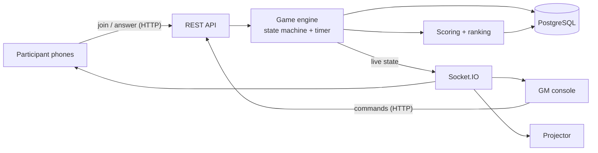
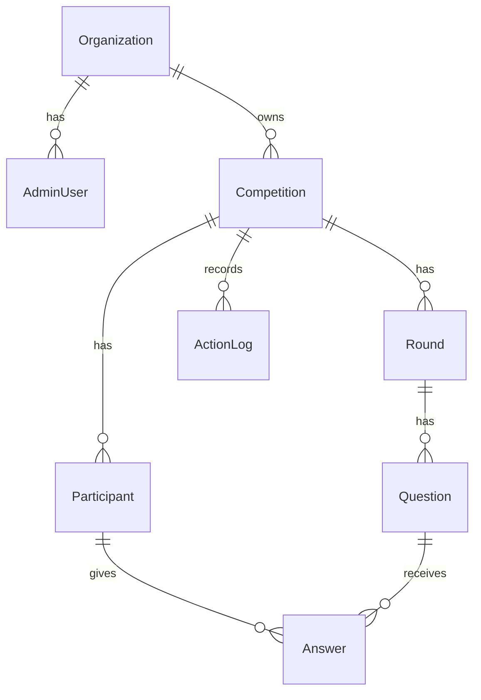
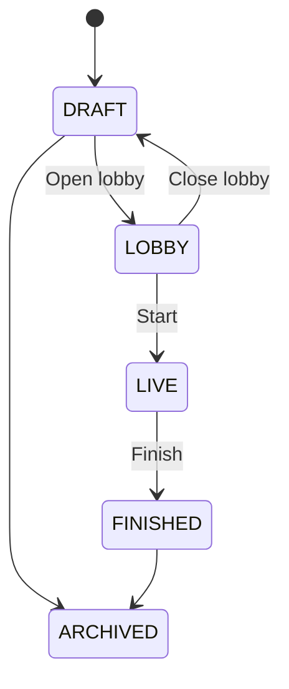
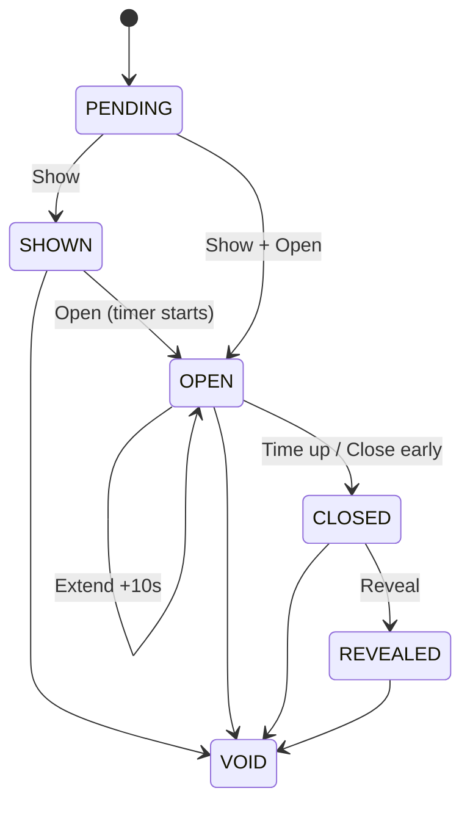

# BitQuiz — Project Plan

A real-time quiz competition website. A Game Master controls the quiz live from a laptop. Questions appear on a projector and on participants' phones. Participants answer on their phones, are scored automatically (faster correct answers earn more points), and see a live leaderboard.

First use: an IEEE CS KUET quiz competition with 100–300 participants.

---

## 1. Overview

### 1.1 What the product does

1. An **admin** logs in and creates a competition with rounds and questions (typed in a form or uploaded as a CSV file).
2. The admin opens the **lobby**. The **projector** shows the join link, a QR code, a join code, and a live count of joined participants.
3. **Participants** scan the QR code on their phones and enter their **Name** and **Roll**.
4. The **Game Master (GM)** runs the quiz from one console page. Every action appears **instantly** on all phones and the projector:
   Show question → Open answering (timer starts) → Close → Reveal answer → Leaderboard → Next.
5. Participants tap one option, and their answer is locked. After the reveal they see ✓/✗, the points earned, and their rank.
6. At the end, the projector shows the final leaderboard and organizers download the results as CSV.

### 1.2 The three screens

| Screen | Device | Role |
| --- | --- | --- |
| Participant `/play/:joinCode` | Phones | Join, answer, see own result |
| GM console `/admin/competitions/:id/console` | Laptop | **Controls everything** |
| Projector `/screen/:token` | Laptop connected to projector | Display only |

### 1.3 Content rules

- Every question is **text**, optionally with a **code block** (also stored as text).
- Each question has **2–6 options** and **exactly one correct option**. True/False is a 2-option question.
- No images, audio, video, or file uploads. All content lives as rows in the database.

### 1.4 Not included

Images, audio, video, free-text answers, fill-in-the-blank, numeric answers, matching, ordering, code submissions, AI generation, payments, chat, native apps, multi-organization signup.

---

## 2. Tech stack

| Layer | Choice | Purpose |
| --- | --- | --- |
| Language | TypeScript | One language for server and browser; shared types |
| Frontend | React + Vite + Tailwind CSS + shadcn/ui + Framer Motion | UI for phones, console, and projector |
| Backend | Node.js 20 + Express | REST API; also serves the built frontend |
| Real-time | Socket.IO | Pushes live state to every screen |
| Validation | Zod (shared package) | Same rules on server and client |
| Database | PostgreSQL 16 + Prisma | All data and state |
| CSV | papaparse | Question import preview, results export |
| Code highlighting | Shiki | Code-block questions |
| QR code | `qrcode` | Join QR on projector |
| Auth | httpOnly session cookie + bcrypt | Admin login |
| Logging | pino | Structured server logs |
| Tests | Vitest + Supertest + Node load-test script | |
| Packaging | Docker + docker-compose | Same build locally and in production |
| Hosting | Render free web service + Neon free PostgreSQL | Free; supports persistent WebSocket connections (see docs/DEPLOY_RENDER.md) |
| CI | GitHub Actions | Typecheck, test, build on every push |

The whole application is **one server process**. It serves the API, the real-time connections, and the website files from a single address.

---

## 3. Architecture



### 3.1 How real-time control works

- **Actions go to the server over HTTP.** GM commands and participant answers are POST requests. The server checks every one before applying it.
- **The server is the only source of truth.** Competition state, current question, timer, answers, and scores are stored in PostgreSQL.
- **State comes back over Socket.IO.** After every change, the server pushes a **state snapshot** to each screen. Each snapshot contains only what that role is allowed to see.
- **Any screen can be refreshed at any time.** When a screen connects or reconnects, it immediately receives the current snapshot and shows the right view.
- Each snapshot has a `revision` number that increases with every change. Screens ignore any snapshot older than the one they already have.

Expected delay from a GM click to the phones: about 100–300 ms on a normal mobile connection.

---

## 4. Database



### Organization

| Field | Type | Notes |
| --- | --- | --- |
| id | uuid | PK |
| name | text | "IEEE CS KUET" |
| slug | text | unique |

Only one organization exists at first. Every competition belongs to one, so other clubs can be added later without changing the design.

### AdminUser

| Field | Type | Notes |
| --- | --- | --- |
| id | uuid | PK |
| organizationId | uuid | FK |
| email | text | unique |
| passwordHash | text | bcrypt |
| role | `OWNER` \| `OPERATOR` | OWNER can also add/remove admins |

### Competition

| Field | Type | Notes |
| --- | --- | --- |
| id | uuid | PK |
| organizationId | uuid | FK |
| title | text | "Algorithm Rush 2026" |
| joinCode | text | unique, 6 characters, e.g. `K7Q2XM` |
| status | `DRAFT` \| `LOBBY` \| `LIVE` \| `FINISHED` \| `ARCHIVED` | |
| rollMinLength / rollMaxLength | int | default 7 / 7 (KUET roll) |
| rollDigitsOnly | bool | default true |
| allowLateJoin | bool | default true |
| displayMode | `LOBBY` \| `QUESTION` \| `LEADERBOARD` \| `HOLD` \| `FINAL` | what the projector shows |
| holdMessage | text? | e.g. "Break: back in 10 min" |
| leaderboardFrozen | bool | |
| currentQuestionId | uuid? | |
| projectorToken | text | secret part of projector URL |
| revision | int | +1 on every state change |
| createdAt / updatedAt | timestamp | |

### Round

| Field | Type | Notes |
| --- | --- | --- |
| id | uuid | PK |
| competitionId | uuid | FK |
| order | int | unique per competition |
| title | text | "Round 1: Algorithm Basics" |
| defaultTimeLimitSec | int | e.g. 20 |
| defaultMaxPoints | int | e.g. 100 (instant correct answer) |
| defaultMinPoints | int | e.g. 50 (correct at the last moment) |
| wrongPenalty | int | default 0 |

### Question

| Field | Type | Notes |
| --- | --- | --- |
| id | uuid | PK |
| roundId | uuid | FK |
| order | int | unique per round |
| prompt | text | the question |
| code | text? | optional code block |
| codeLanguage | text? | `c`, `cpp`, `python`, `java`, … |
| options | jsonb | `[{ "id": "A", "text": "DFS" }, …]`, 2–6 items |
| correctOptionId | text | e.g. `"B"` |
| explanation | text? | shown after reveal |
| timeLimitSec | int? | overrides round default |
| maxPoints / minPoints | int? | override round defaults |
| status | `PENDING` \| `SHOWN` \| `OPEN` \| `CLOSED` \| `REVEALED` \| `VOID` | |
| shownAt / openedAt / endsAt / closedAt / revealedAt | timestamp? | |

### Participant

| Field | Type | Notes |
| --- | --- | --- |
| id | uuid | PK |
| competitionId | uuid | FK |
| name | text | 2–40 characters |
| roll | text | validated by the competition's roll rules |
| tokenHash | text | hash of the device token |
| latencyMs | int | measured network delay (section 8.3) |
| kicked | bool | |
| joinedAt / lastSeenAt | timestamp | |
| — | unique | **(competitionId, roll)** |

### Answer

| Field | Type | Notes |
| --- | --- | --- |
| id | uuid | PK |
| participantId | uuid | FK |
| questionId | uuid | FK |
| optionId | text | `"A"`…`"F"` |
| clientRequestId | text | makes retries safe |
| receivedAt | timestamp | server time |
| responseMs | int | adjusted answer time (section 8.3) |
| isCorrect | bool | |
| points | int | |
| — | unique | **(participantId, questionId)**: one answer per question, enforced by the database |

### ActionLog

| Field | Type | Notes |
| --- | --- | --- |
| id | bigserial | PK |
| competitionId | uuid | FK |
| actor | text | admin id or `system` |
| action | text | `OPEN_QUESTION`, `REGRADE`, `KICK`, … |
| payload | jsonb | details |
| at | timestamp | |

Total scores are calculated from the `Answer` table (sum of points for non-voided questions), so they stay correct when a question is voided or regraded.

---

## 5. Participant join (Name + Roll)

### Join screen

```text
┌──────────────────────────┐
│  Algorithm Rush 2026     │
│                          │
│  Name                    │
│  [ Your full name      ] │
│                          │
│  Roll                    │
│  [ e.g. 2107001        ] │
│                          │
│  [       Join       ]    │
└──────────────────────────┘
```

### Rules

- **Name:** required, 2–40 characters, trimmed.
- **Roll:** required, checked against the competition's settings (default: digits only, exactly 7). Phones show a numeric keypad.
- Both are checked on the phone and again on the server.
- **First join** creates the participant and gives the phone a random device token, saved in the browser.
- **Refresh or reopen on the same phone:** the token signs the participant back in automatically.
- **A Roll that has already joined from another phone is rejected:** "This roll has already joined. Ask the organizer." Nobody can take over someone else's roll.
- **Real phone change:** the GM clicks **Reset device** next to that participant. The participant can then join again on the new phone and keeps their points.
- The GM can **kick** fake or offensive entries and **edit** a misspelled name.
- Leaderboards show **Name (Roll)**.

---

## 6. Competition flow and states

### 6.1 Competition states



| State | Meaning |
| --- | --- |
| DRAFT | Being edited. Nobody can join. |
| LOBBY | Participants can join. The projector shows QR code + join count. Opening the lobby first checks that every question has 2+ options, a correct option, and a time limit. |
| LIVE | Questions are running. Question text and options are locked; only the correct answer can be changed (Regrade). Late joining is allowed if enabled. |
| FINISHED | Final leaderboard shown; results downloadable. |
| ARCHIVED | Hidden from the main list; data kept. |

Breaks during LIVE: the GM switches the projector to **Hold** with a message.

### 6.2 Question states



| State | Projector | Phones |
| --- | --- | --- |
| PENDING | — | — |
| SHOWN | Question + options, no timer | Question + options greyed out: "Get ready…" |
| OPEN | Timer running | Options active, timer bar |
| CLOSED | "Time's up" + how many answered | "Waiting for the answer…" |
| REVEALED | Correct option + % per option + explanation | ✓/✗, points earned, rank |
| VOID | — | Question doesn't count |

- **SHOWN** lets the host read the question aloud before the timer starts. **Show + Open** does both at once.
- Only one question can be SHOWN, OPEN, or CLOSED at a time.
- To re-ask a voided question, the GM uses **Duplicate**, which inserts a copy as the next question.

### 6.3 GM commands

| Command | Allowed when | Result |
| --- | --- | --- |
| `OPEN_LOBBY` / `CLOSE_LOBBY` | DRAFT ↔ LOBBY | Join screen on/off |
| `START` | LOBBY | Phones: "Get ready" |
| `SHOW_QUESTION` | LIVE, no active question | Question visible, answering locked |
| `OPEN_QUESTION` | SHOWN (or PENDING for Show + Open) | Timer starts everywhere |
| `EXTEND` | OPEN | Deadline +10 s everywhere |
| `CLOSE_QUESTION` | OPEN | Answering stops |
| `REVEAL` | CLOSED | Answer, points, ranks shown |
| `VOID_QUESTION` | SHOWN / OPEN / CLOSED / REVEALED | Question's points removed |
| `REGRADE` | CLOSED / REVEALED | Correct option changed, points recalculated |
| `DUPLICATE_QUESTION` | LIVE | Copy inserted as the next question |
| `SET_DISPLAY` | any | Projector: Lobby / Question / Leaderboard / Hold / Final |
| `FREEZE_LEADERBOARD` / `UNFREEZE_LEADERBOARD` | LIVE | Public ranks stop/resume updating |
| `KICK` / `RESET_DEVICE` / `EDIT_NAME` | LOBBY / LIVE | Participant management |
| `FINISH` | LIVE | Final screen everywhere |

### 6.4 Safe control

- Every command includes the `revision` number the GM's screen is showing.
- The server applies the command **only if that revision is still current**, in a single database transaction. Otherwise it returns **409 Conflict** with the latest state, and the console refreshes itself.
- A double-click on "Next" therefore never skips a question, and a backup GM laptop can stay open at the same time.
- Every command is also checked against the allowed-transitions table above, and every command is written to the ActionLog.

---

## 7. Timer and answer acceptance

### 7.1 Timer

- When a question opens, the server records `openedAt` and `endsAt = openedAt + timeLimit` in the database, then pushes them to all screens.
- Every snapshot includes the server's current time. Each screen calculates the difference from its own clock, so a wrong phone clock doesn't affect the countdown.
- Phones disable the option buttons at 0.
- The server closes the question automatically at `endsAt + 1 s`. The extra second absorbs network delay; it isn't extra thinking time, because buttons are already disabled.
- **If the server restarts,** it reloads all LIVE competitions on startup. A question whose deadline has passed is closed. Otherwise its automatic close is scheduled again.

### 7.2 An answer is accepted only if

1. the device token is valid, belongs to this competition, and the participant isn't kicked;
2. the competition is LIVE;
3. the question is the current question and is OPEN (or CLOSED less than 1 s ago);
4. the server received it no later than `endsAt + 1000 ms`;
5. the participant hasn't answered this question yet (the database's unique rule enforces this).

- **One answer per question, locked.** It can't be changed.
- **Retries are safe.** Each answer carries a `clientRequestId`. If the network drops and the phone sends it again, the server returns the saved answer, and the phone shows "Locked ✓".
- **Answer secrecy.** The correct option and explanation are never sent to phones or the projector before REVEAL. Questions that haven't been shown yet are never sent at all.

---

## 8. Scoring (speed-based)

### 8.1 Formula

Every correct answer earns **between `minPoints` and `maxPoints`**. The faster the answer, the closer it is to `maxPoints`.

```text
fraction = responseMs / timeLimitMs            (clamped to 0…1)
points   = round( maxPoints − (maxPoints − minPoints) × fraction )

wrong answer  → −wrongPenalty   (default 0)
no answer     → 0
```

- Points fall **linearly** from `maxPoints` (instant) to `minPoints` (last moment).
- A correct answer **always earns at least `minPoints`**, and `minPoints` must be ≥ 1. The editor rejects `minPoints < 1` and `minPoints > maxPoints`.
- Values are set per round and can be overridden per question (e.g. a harder question worth 200/100).

### 8.2 Recommended defaults

**Max 100, Min 50, time limit 20 s, no penalty.**

| Answer time (20 s limit) | Correct | Wrong |
| --- | --- | --- |
| 1 s | 98 | 0 |
| 5 s | 88 | 0 |
| 10 s | 75 | 0 |
| 15 s | 63 | 0 |
| 20 s (last moment) | 50 | 0 |

Why min = 50% of max: a slow correct answer is still worth at least half of a perfect one. **Being correct always matters more than being fast.** Two slow correct answers (50 + 50) equal one perfect instant answer (100), and a fast wrong answer earns nothing.

If you want speed to matter more, lower `minPoints` (e.g. 100/20). The minimum allowed is 1.

### 8.3 Fair answer time on mobile networks

Phones have different network delays, so the server adjusts the measured time for each participant's own connection speed:

```text
responseMs = (receivedAt − openedAt) − participant.latencyMs
```

- Every phone pings the server every few seconds. The server keeps an estimate of that phone's **one-way network delay** (half of the round-trip time, taken from the faster recent pings).
- The adjustment is **capped at 500 ms**, so it can't be abused by faking slow pings.
- `responseMs` is never below 0.
- Result: a participant on a slow 4G connection isn't punished for their network's delay.

### 8.4 Ranking

1. Total points (high → low)
2. Number of correct answers (high → low)
3. Total `responseMs` of correct answers (low → high)
4. Still equal → same rank. For prize positions, the GM runs a **tiebreaker question**. Announce this rule before the event.

### 8.5 Regrade and void

- **Regrade:** the GM picks the right option. The server recalculates `isCorrect` and points for every answer to that question in one transaction (answer times are already saved), then updates the leaderboard.
- **Void:** that question's points are removed from everyone's total.

### 8.6 Leaderboard

- Updated on Reveal, Void, and Regrade (not on every tap). Kept in memory between updates.
- **Projector:** top 10 when the GM selects Leaderboard, with animated position changes.
- **Phones:** own points, total, and rank after each reveal.
- **GM:** full table at all times.
- **Freeze:** hides rank changes from phones and the projector (e.g. for the final round), so the final reveal keeps its suspense.

---

## 9. Screens

### 9.1 Participant (phone)

| Moment | Screen |
| --- | --- |
| Join | Name, Roll, Join |
| Lobby | "You're in, Rahim (2107001). Watch the screen." + joined count |
| SHOWN | Question (+ code), options greyed out, "Get ready…" |
| OPEN | Large A/B/C/D buttons, timer bar → tap → **Locked ✓** |
| CLOSED | "Time's up. Waiting for the answer…" |
| REVEALED | ✓ Correct **+88** (answered in 5.0 s) / ✗ Wrong, total points, rank |
| HOLD | GM's message |
| FINISHED | Final points and rank |
| Connection lost | Small "Reconnecting…" banner; recovers automatically |

Large tap targets, high contrast, and lightweight pages so it works on low-end Android phones.

### 9.2 GM console (laptop, single page)

```text
┌───────────────┬──────────────────────────────────┬─────────────────────┐
│ RUN SHEET     │  R1 · Q4 / 10        ⏱ 00:12     │ LIVE STATS          │
│ R1 Basics     │                                  │ Joined     287      │
│  ✓ Q1  ✓ Q2   │  Which algorithm finds shortest  │ Connected  281      │
│  ✓ Q3  ● Q4   │  paths with non-negative weights?│ Answered   203/281  │
│  ○ Q5 …       │                                  │                     │
│ R2 Code       │  A DFS  B Dijkstra ✔  C Prim  D … │ A ██ 21  B ████ 140 │
│  ○ Q1 …       │                                  │ C █ 18   D █ 24     │
│               │ [ CLOSE ]  [+10s]  [ VOID ]      │                     │
│               │                                  │ TOP 10              │
│               │ Projector: [Lobby][Question]     │ 1. Rahim (2107001) 412│
│               │ [Leaderboard][Hold][Final]       │ 2. Nila (2107044)  398│
│               │ [Freeze leaderboard]             │                     │
├───────────────┴──────────────────────────────────┴─────────────────────┤
│ ● Server OK   ● Projector connected   ● 42 ms   [Participants ▸]       │
└──────────────────────────────────────────────────────────────────────────┘
```

- The main button always shows the **next step**: Show → Open → Close → Reveal → Next question.
- Keyboard: `Space` = next step, `L` = leaderboard, `H` = hold, `Q` = question view.
- Void, Regrade, Kick, and Finish ask for confirmation.
- The Participants panel lets the GM search by name or roll, kick, reset the device, or edit the name.
- The correct answer is visible **only** on the console.

### 9.3 Projector (fullscreen)

| Mode | Content |
| --- | --- |
| Lobby | Big QR code, URL, join code, live joined count |
| Question | Round/question number, question text (≥ 48 px), code block, options (≥ 36 px), large timer (amber in the last 5 s) |
| Reveal | Correct option highlighted, % per option, explanation |
| Leaderboard | Top 10: Name (Roll) + points, animated |
| Hold | GM's message |
| Final | Top-3 podium + top 10 |

- Opened at `/screen/<secret token>`. It needs no login and can't control anything. The token can be regenerated from the console.
- A **Go fullscreen** button on first load.

### 9.4 Visual style

Dark navy/near-black background, one accent color (IEEE blue / electric cyan), amber for timer warnings, green/red only for correct/wrong. Headings in Space Grotesk, body in Inter, code in JetBrains Mono. Animation only for the timer, the answer reveal, and leaderboard movement.

---

## 10. CSV import and export

### 10.1 Question import (one row per question)

```csv
round,order,question,code,code_language,option_a,option_b,option_c,option_d,option_e,option_f,correct,max_points,min_points,time_limit,explanation
1,1,"Which algorithm finds shortest paths with non-negative weights?",,,DFS,Dijkstra,Prim,Kruskal,,,B,100,50,20,"Dijkstra uses a priority queue."
1,2,"Dijkstra can handle negative edge weights.",,,True,False,,,,,B,100,50,15,
2,1,"What is the output?","for(int i=0;i<3;i++) printf(""%d"",i);",c,012,123,0123,Error,,,A,200,100,30,
```

- Missing rounds are created as "Round N". Empty `max_points`, `min_points`, `time_limit` use the round defaults.
- The import page shows a **preview table with errors per row** (e.g. "Row 7: correct is E but option_e is empty"; "Row 9: min_points must be at least 1") before saving.
- An import either saves every row or none.
- The editor has a **Download template** button. Questions can be prepared in Google Sheets and downloaded as CSV.

### 10.2 Results export

`results.csv`:

```csv
rank,name,roll,points,correct,wrong,unanswered,total_correct_time_ms
1,Rahim Ahmed,2107001,412,5,0,0,21450
```

`answers.csv` has one row per participant per question: chosen option, correct or wrong, answer time, and points. Use it to settle disputes.

---

## 11. API

### Admin (session cookie)

```text
POST   /api/auth/login              POST /api/auth/logout          GET /api/auth/me
GET    /api/competitions            POST /api/competitions
GET    /api/competitions/:id        PATCH /api/competitions/:id    DELETE /api/competitions/:id   (DRAFT only)
POST   /api/competitions/:id/rounds          PATCH/DELETE /api/rounds/:id
POST   /api/rounds/:id/questions             PATCH/DELETE /api/questions/:id
POST   /api/competitions/:id/import          CSV → validate → save all or nothing
GET    /api/competitions/:id/template.csv
POST   /api/competitions/:id/commands        { type, revision, ...args }
GET    /api/competitions/:id/participants
GET    /api/competitions/:id/leaderboard
GET    /api/competitions/:id/results.csv
GET    /api/competitions/:id/answers.csv
GET    /api/competitions/:id/log
```

### Participants

```text
GET    /api/join/:joinCode     → competition title + roll rules
POST   /api/join               { joinCode, name, roll } → { token }
POST   /api/answers            { questionId, optionId, clientRequestId }   (Bearer token)
```

### Health

```text
GET    /healthz    server is running
GET    /readyz     database is reachable
```

### Socket.IO (server → screens)

| Event | Sent to | Contents |
| --- | --- | --- |
| `state` | each role separately | revision, server time, competition status, display mode, current question (role-safe), timer; participants also get `me` (answered?, last result, points, rank) |
| `stats` | GM | joined, connected, answered count, option counts after close (max 2 updates/s) |
| `leaderboard` | GM (full), projector (top 10) | ranks, names, rolls, points |
| `pong` | sender | server time, used for clock sync and latency measurement |

Screens prove who they are when connecting: admin session cookie, participant token, or projector token. **The server decides which updates each screen receives.**

---

## 12. Security

- Admin passwords hashed with bcrypt. Login limited to 5 attempts per minute per IP.
- Admin session: httpOnly, Secure, SameSite=Lax cookie. Admin POST requests also require a custom header.
- Participant device token: 32 random bytes; only its hash is stored.
- Every admin query is filtered by the admin's organization in one shared helper.
- Every request body is validated with Zod. Database access only through Prisma.
- Question text is always displayed as plain text, never as HTML.
- Security headers via `helmet`.
- Rate limits: join (high per-IP limit, e.g. 600/min, because a whole hall can share one IP), answers (per participant), login (strict).
- Correct answers and unshown questions never reach phones or the projector early. A unit test checks this.
- Secrets live in environment variables. `.env` is in `.gitignore`.

---

## 13. Failure handling

| What happens | System behaviour | Action |
| --- | --- | --- |
| Phone refreshed / locked / tab closed | Token signs back in; screen restored | None |
| Phone dies or participant changes phone | New phone with same roll is rejected | GM: Reset device; participant rejoins |
| Projector page crashes | Reopen URL; current screen restored | Volunteer |
| Projector laptop dies | Open projector URL on another laptop | Volunteer |
| GM laptop dies | Log in on backup laptop; console restored | GM |
| GM double-clicks / two GMs | Conflict detected; nothing happens twice | None |
| Server restarts | State reloaded from database; timer restored | Wait about 10 s |
| Wrong answer key | Regrade | GM |
| Ambiguous question | Void (Duplicate to re-ask) | GM |
| Venue Wi-Fi poor | Participants use mobile data | Announce |
| Everything down | Paper answer sheets for that round; scores entered afterwards | Organizers |

Download `results.csv` after each round as an extra backup.

---

## 14. Project structure

```text
website/
├─ docs/PLAN.md
├─ package.json               npm workspaces: shared, server, web
├─ tsconfig.base.json
├─ Dockerfile                 build web + server → small runtime image
├─ docker-compose.yml         app + postgres for local development
├─ .env.example
├─ .github/workflows/ci.yml   install → typecheck → test → build
├─ shared/src/
│  ├─ schemas.ts              Zod: join, answer, commands, CSV row, snapshots
│  ├─ enums.ts                statuses, display modes, command types
│  ├─ rules.ts                allowed state transitions
│  └─ scoring.ts              points formula (also used for previews in the editor)
├─ server/
│  ├─ prisma/schema.prisma
│  ├─ prisma/seed.ts          organization + owner admin + demo competition
│  └─ src/
│     ├─ index.ts             Express + Socket.IO + website files
│     ├─ auth/
│     ├─ competitions/        CRUD, settings, roll rules
│     ├─ questions/           CRUD, CSV import/export
│     ├─ participants/        join, token, kick, reset, edit name, latency
│     ├─ engine/              state machines, commands, timers
│     ├─ answers/             acceptance rules
│     ├─ scoring/             evaluate, score, rank, regrade
│     ├─ realtime/            snapshots per role, rooms, ping/pong
│     └─ lib/                 db, logger, rate limits, errors
├─ web/src/
│  ├─ pages/play/             join + participant screens
│  ├─ pages/admin/            login, competition list, editor, import, results
│  ├─ pages/console/          GM console
│  ├─ pages/screen/           projector
│  ├─ components/ui/          shadcn components
│  └─ lib/                    API client, socket hook, clock sync
└─ tools/loadtest/            300 simulated participants
```

### Routes

| URL | Who |
| --- | --- |
| `/` | Landing: "Join a quiz" / "Organizer login" |
| `/play/:joinCode` | Participants |
| `/admin/login` | Admins |
| `/admin/competitions` | Competition list / create |
| `/admin/competitions/:id/edit` | Settings, roll rules, rounds, questions, scoring, CSV import |
| `/admin/competitions/:id/console` | GM live control |
| `/admin/competitions/:id/results` | Final table + CSV downloads |
| `/screen/:projectorToken` | Projector |

---

## 15. Deployment

### 15.1 Environment variables

| Name | Example | Notes |
| --- | --- | --- |
| `DATABASE_URL` | `postgresql://…` | Neon pooled connection + `&pgbouncer=true` |
| `DIRECT_URL` | `postgresql://…` | Neon direct connection (migrations) |
| `SESSION_SECRET` | 64 random characters | |
| `PUBLIC_URL` | `https://bitquiz.example.com` | Used in QR code and join link |
| `ANSWER_GRACE_MS` | `1000` | |
| `LATENCY_CAP_MS` | `500` | |
| `NODE_ENV` | `production` | |
| `PORT` | `3000` | Set by Render |
| `SEED_ADMIN_EMAIL` / `SEED_ADMIN_PASSWORD` | | First owner account; change password after first login |

### 15.2 Local development

1. `docker compose up -d db`
2. `npm install`
3. `npm run db:migrate && npm run db:seed`
4. `npm run dev`

### 15.3 Production on Render + Neon (free)

Step-by-step: [DEPLOY_RENDER.md](DEPLOY_RENDER.md). Render builds the `Dockerfile` from `render.yaml` (one free instance in Singapore); the database is a free Neon project. Run the 300-player load test against it before the event; if the free CPU is not enough, run on a venue laptop or upgrade Render for the event month.

### 15.4 Backups and rollback

- Neon keeps a short history for point-in-time restore; also take a manual `pg_dump` on the morning of the event.
- Rollback: redeploy the previous deploy from the Render dashboard.
- No deployments or database changes in the 24 hours before the event.

### 15.5 Local network fallback

The same `docker-compose.yml` can run on one laptop. Phones and the projector join the same router and open `http://<laptop-ip>:3000`. Rehearse this once if the venue's internet is unreliable.

---

## 16. Testing

| Level | What is tested | Tool |
| --- | --- | --- |
| Unit | Allowed/blocked state transitions; answer acceptance (before, at, within grace, after deadline); **scoring formula** (instant, middle, last moment, min ≥ 1, latency cap); ranking ties; regrade; Name/Roll validation; CSV row validation; no answer leak in participant/projector data | Vitest |
| Integration | Login; create → import → lobby → live → finish; duplicate answer returns the saved one; stale revision → 409; duplicate roll rejected; reset device works | Vitest + Supertest + test database |
| Real-time | Connect → snapshot; reconnect → same snapshot; older revision ignored | socket.io-client |
| Load | **300 simulated participants** join, receive every update, answer at random times; a scripted GM runs 10 questions on the live server | `tools/loadtest` |
| Human rehearsal | 20–30 real phones, venue Wi-Fi + mobile data, real projector, real questions | Dry run |

**Load test passes when:** 95% of simulated participants receive each update within 1 s, no accepted answer is lost, there are no server errors, and CPU stays below 70%.

---

## 17. Build order

| # | Task | Done when | Hours |
| --- | --- | --- | --- |
| 1 | Project setup: workspaces, Docker Compose, Prisma, Express serves the Vite app, Socket.IO connects | `npm run dev` works | 2–3 |
| 2 | Database schema, migration, seed | Demo data visible | 1–2 |
| 3 | State machines, answer rules, scoring formula, ranking, all with unit tests | All tests pass | 4–5 |
| 4 | Admin login | Protected admin pages | 2 |
| 5 | Competition editor: settings, roll rules, rounds, questions, scoring values with point preview | A quiz can be built by form | 4 |
| 6 | CSV import (preview + errors), template, results export | 40 questions imported in 2 minutes | 3 |
| 7 | GM commands + live snapshots per role + latency ping | Two browsers stay in sync | 3–4 |
| 8 | Participant join (Name + Roll) and answering | Full flow on a real phone | 3–4 |
| 9 | GM console | Whole quiz runnable with the keyboard | 4–5 |
| 10 | Projector | Readable from the back of a room | 3 |
| 11 | Deploy to Render + Neon | Public URL works on mobile data | 2 |
| 12 | Load test and fixes | Pass criteria met | 2–3 |

**Total: about 33–41 hours of focused work**, followed by a rehearsal with real phones. Deploy at step 11 even if the design still needs polish.

---

## 18. Event checklist

### A few days before

- [ ] All questions imported; a second person checks every correct answer.
- [ ] Scoring (max/min points, penalty) and tie-break rules announced to participants.
- [ ] Load test passed on the live URL.
- [ ] Full rehearsal with real phones, the projector, and the venue network.

### Day before

- [ ] No more code changes or deployments.
- [ ] Database backup taken; `results.csv` download tested.
- [ ] Backup GM laptop logged in; projector URL saved on a second laptop.
- [ ] Printed: QR/URL poster, rules, paper answer sheets (emergency).

### One hour before

- [ ] Competition in LOBBY; projector fullscreen showing the QR code.
- [ ] Three volunteers join using different networks (venue Wi-Fi, Grameenphone, Robi, …).
- [ ] Console shows Server OK and Projector connected.
- [ ] Phone hotspot charged for the GM laptop.

### During the event

- [ ] Download `results.csv` after each round.

---

## 19. Decisions to confirm

1. **Competition date.** If it's very soon, keep Kahoot, Mentimeter, or Google Forms ready as a backup.
2. **Individuals or teams?** (For teams: one phone per team, team name in the Name field, team leader's roll in Roll.)
3. **Roll format:** digits only, exactly 7 characters? Any participants from outside KUET with a different format?
4. **Scoring defaults:** max 100 / min 50 / 20 s / no penalty?
5. **Phones:** show the full question text, or only the A/B/C/D buttons while the projector shows the question? Buttons only makes it harder to copy the question into Google.
6. **Elimination between rounds** (for example, top 20 go to the final)? This needs one extra field and one GM action, which aren't in this plan yet.
7. **Code-block questions:** keep them?
8. **Hosting account and domain:** who owns them?
